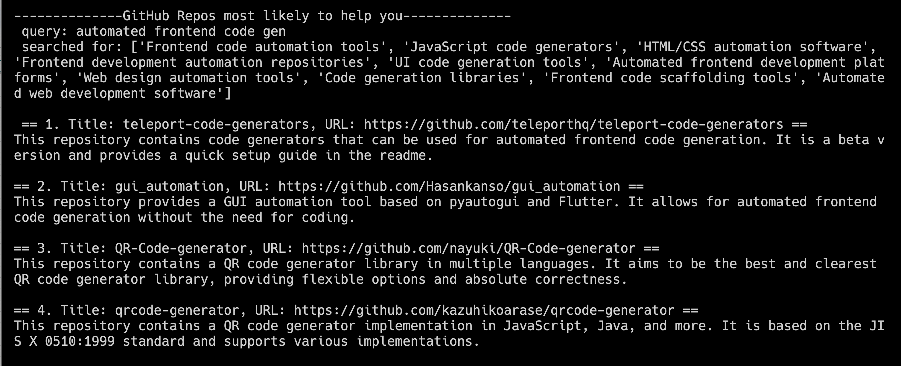

# minchain

One step towards automated tool discovery for agents. 

In this first example, we browse GitHub for repositories that may help the user/agent to solve the problem at hand. 

This tool is also useful to humans in the meantime. 

Problem: If a human (or an agent) could access the right tool at the right time to include in its own code, then it could solve a wider range of problems. 

This tool: 
- takes in a description of a problem that the user is trying to solve
- generates a broad list of search queries that may find related tools
- compiles the READMEs of all the repositories that come up from those search queries
- evaluates each README for its potential to help with the problem
- returns a list of the repositories most relevant to the problem, with steps for how the user or agent could use that tool

